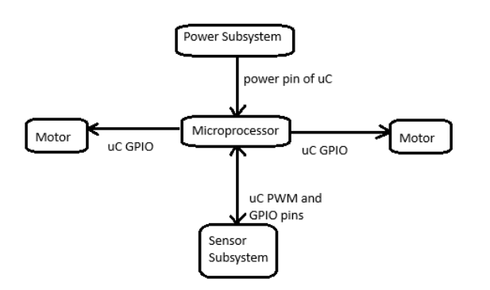
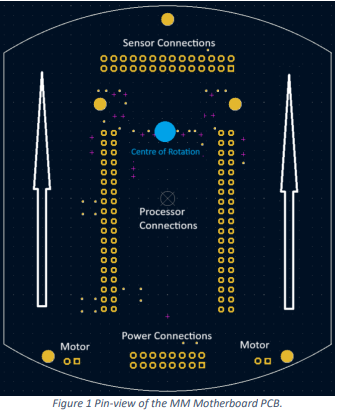

# Micro-mouse-
Development of the sensing and power subsystems of a micro-mouse.

This project concerns designing an infrared sensor subsystem and power subsystem with an existing micro-mouse motherboard and housing. This 
project uses the STM32L476 microcontroller and two motors.
